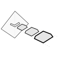

# Impatient pyramids

Setting:
- In mapping-applications, we sometimes wait for a long time until results are calculated.
- That's because we cover a large area, with many pixels in it.
- But **what we actually view is usually that large area from a distance**, that is, zoomed out very far.
    - That's common practice in GIS and called pyramids: the user sees some zoom level that is an aggregated view of the layers underneath.
- It seems wasteful to calculate results for every pixel, when we only look at a rough summary of them.
- Also, when aggregating per-pixel-results to higher zooms, often **the effect of one individual pixel is very small**.
    - In fact, we **can often approximate the aggregated value quite decently with only a few pixels**, not all of them.

Basic idea: 
- Work from a high zoom down to pixel values, not the other way round.
- Don't take into account all pixels immediately, but instead return some preliminary results with only a fraction of the pixels.
- Return those preliminary results early, and refine later.

In detail:
- **Streaming**: don't return one value at the end of the calculation - instead, stream out increasingly better estimates.
- **Sampling**: to get the aggregated value at some pyramid-tile, don't use all datapoints in the tile's sub-pyramid, but instead just sample a few.

## prototype 1
Hacked together really quickly so I wouldn't forget the basic idea.

## prototype 2
Refined prototype in typescript, because with TS I don't have to keep all those return types in my head.
